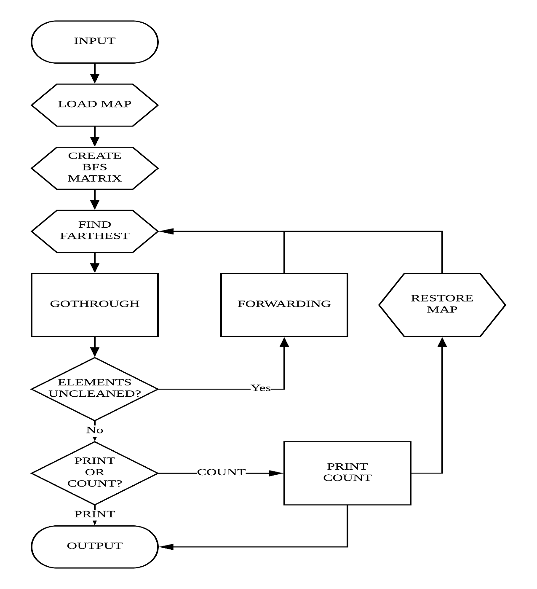

## Data Structure Project 2 Report
    ID:106062119
    Name: 王元廷
### 1. Project Description  
#### 1.1 Program Flow Chart


#### 1.2 Detailed Description
* **``GENERAL CONCEPT``**  
  In my design of floor cleaning robot, I made the robot to go to the farthest point first, then the second, then the third, etc, until all the reachable points in cleaned. Besides, every subpath is iterated in shortest path by BFS distance table. In my intuition, this should be the most efficient way when facing general data. 
  > Here's my thought:  
  Cleaning the elements from the farthest could also clean through all elements in its path, which can reduce the number of subpaths by aborting the target point if it has already been iterated through.  
  But when we clean from the nearest to the farthest, there is no such 'positive side effect' cleaning through the path. At the end there will be many long and tough paths just to clean a single new point, and this is really inefficient.

  To make the memory usage efficient, I abort the use of queue/vector to store the answer paths. Instead, I run the whole process twice; first time just to count the total number of steps and the second time prints out the steps immediately when the robot goes through.  
  > Some *final.path* contain millions of steps, which means the answer queue/vector could consume much much memory usage. Hence, since the time limit is as long as 30 seconds, I decide to run the process twice to reduce memory usage.  

  Some noticeable detailed implementation is discussed below. 
* **``LOAD MAP``**
  ```c++
  //Part of a C++ Program//
    infile >> M >> N >> B;
    map.reserve(M * N);

    for (int i = 0; i < M; i++)
    {
        for (int j = 0; j < N; j++)
        {
            char ch;
            infile >> ch;
            map.push_back(ch);
            if (map[TARGET] == 'R')
            {
                ri = i;
                rj = j;
            }
        }
    }
    map.shrink_to_fit();
    _map = map;
  ```
  First, it loads the values of *M*, *N* and *B* and reserves the memory of the map to store **(M * N)** elements.  
  Then for every index from **0** to **(M\*N)-1**, it loads the entire corresponding *floor.data* file to the *vector\<char\> map* and finds out the recharge points *ri* and *rj*.  
  Lastly, calling *map.shrink_to_fit()* enables the map to be copied correctly, which is necessary because we are going to run the process twice and thus have to store the initial map for restoring.  

  > *map.shrink_to_fit()* makes itself to have the correct *map.size()*.  
  If we do not do this process, the program would seem *map.size()* as 0.

* **``CREATE BFS MATRIX``**
  ```c++
  //...Inside main processing function 'cleaning_naive()' ...//
    bfs_r = BFS(ri, rj, map, 1);
    bfs_up = BFS(ri - 1, rj, map, 0);
    bfs_down = BFS(ri + 1, rj, map, 0);
    bfs_left = BFS(ri, rj - 1, map, 0);
    bfs_right = BFS(ri, rj + 1, map, 0);
  ```
  This is another preparation process. I set up five distance matrices, *bfs_r* to show the shortest distance to the recharge point *(ri, rj)* and the other four be the distance matrices when leaving from the four direction respectively. Later when start planning the path, the program would choose the farthest point to be the first destination and the direction with the shortest distance to it to be its leaving direction. Part of the implementation of creating such matrices is illustrated below:
  ```c++
  //Part of a C++ Program//
  using namespace std;

  //...BFS Function ...//
    vector<int> BFS(int i, int j, vector<char> tmap, bool flag)
    {

        vector<int> bfs(M * N, B + 1);
        if (i < 0 || j < 0 || i >= M || j >= N || map[TARGET] == '1')
            return bfs;

        queue<pair<int, int>> q;
        pair<int, int> ptr;

        q.push(make_pair(i, j));
        bfs[TARGET] = ((flag) ? 0 : 1);
        tmap[TARGET] = 'D';

        while (q.empty() == false)
        {
            ptr = q.front();
            i = ptr.first;
            j = ptr.second;
            int cnt = bfs[TARGET] + 1;
            if ((cnt > B) && flag == 0)
                break;

            if (i > 0)
                if (tmap[T_UP] == '0')
                {
                    q.push(make_pair(i - 1, j));
                    if (flag)
                        dest.push_back(make_pair(q.back(), cnt));
                    bfs[T_UP] = cnt;
                    tmap[T_UP] = 'D';
                }
            /*
            if (i < M - 1) if(/....)
            if (j > 0) /...
            if (j < N - 1) /...
            */
            q.pop();
        }

        i = ri;
        j = rj;
        bfs[TARGET] = B;
        return bfs;
    }
  ```
  In this function, an initial form of distance matrix is set by assigning all of the index **(B+1)**. Then it detects whether *i* and *j*, or the one leaving direction of recharge point, is valid. So if a recharge point is adjacent to obstacles, the distance matrix of its corresponding direction will all be **(B+1)**.  
  > Setting the initial value **(B+1)** could represent infinity since one with battery capacity **B** can never reach the point with distance **(B+1)**. 

  After setting up the initialized matrix, a general implementation of breadth first search is performed to find all shortest distance values.  
  > The bool *flag* is set for generating *bfs_r*.  
  When generating *bfs_r*, the function also pushes the position and distance values into a stack name *dest*. *dest* is used to determine the farthest point to the recharge point, and it can easily be reached through *dest.back()* and *dest.pop()* by the First-In-Last-Out property of stacks.
* **``GOTHROUGH``**
  ```c++
  //Part of a C++ Program//
  using namespace std;
  enum Action{UP,DOWN,LEFT,RIGHT,ERROR};

  //...gothrough Function ...//
    Action gothrough(int i, int j, const Action action, const Action next)
    {
        //...
        switch (action)
        {
        case UP:
            while (bfs_up[TARGET] < B)
            {
                map[TARGET] = 'D';
                stk.push_back(make_pair(i, j));
                go_a_step(i, j, bfs_up, action);
            }
            while (stk.empty() == false)
            {
                i = stk.back().first;
                j = stk.back().second;
                if (print)
                    outfile << i << ' ' << j << '\n';
                else
                    anscnt++;
                stk.pop_back();
                curB--;
            }
            i = initi;
            j = initj;
            return goback(i, j, next, action, curB);
            break;
        case DOWN:
            //....
            break; //...
        }
    }
  ```
  This function simply makes a shortest path toward destination *(i, j)* by making use of the distance matrix. In implementation, it iterates from the destination back to the recharge point, so by pushing them into stack and then popping them out, the correct order of path is printed.  
  As for the *goback* function, it checks whether the robot has enough battery *curB* to move to the port of the next leaving direction. If so, the robot will return to the direction for the next destination when going back. If not, it will return to its initial leaving port (or another port which is closer to the next leaving direction after optimization) and call the *forwarding* function to move to the next leaving port.
  > For the *goback* and *forwarding* functions, please refer to ***code.cpp***.

### 2. Test case Design
#### 2.1 Detailed Description of the Test Case 
My testcase is designed with a **1000 * 1000** map and the battery capacity **2000**, and the recharge point is set at the middle of the map, which is *(500, 500)*.  
I think that everyone should pass this type of testcases (map without obstacles) before he or she heads into dealing with more complicated maze-type testcases. So I simply make the largest general testcase with a 'just-enough' battery capacity for the farthest point.   
To conclude, it is a general testcase to test how well a algorithm is when there is no obstacles.   
A moderate algorithm should pass this case in less than five seconds.